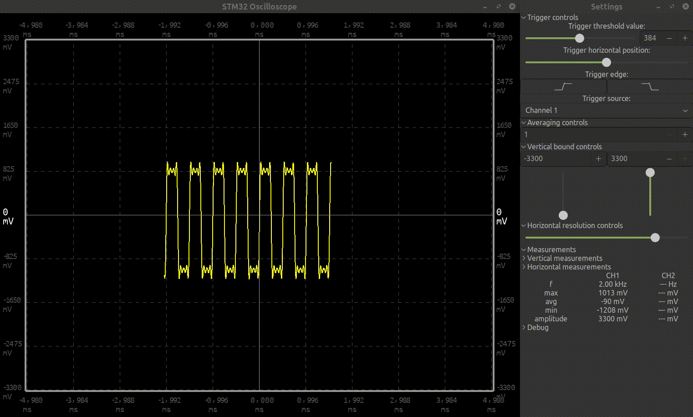

# STM32-based digital oscilloscope

### This repository contains source code for oscilloscope desktop software displaying measurements. The other half of this project is oscilloscope device itself, stored in separate repository [stm32_oscilloscope-device](https://github.com/przmajerczak/stm32_oscilloscope-device)

## Features:
 - Single or dual channel waveform visualization with both vertical and horizontal zoom
 - Trigger threshold, edge and channel selection
 - Waveform smoothing by averaging over selected number of samples
 - Vertical (voltage) and horizontal (time) manual measurements
 - Basic parameters, like frequency, min/max value etc.

## How it works
1. First thread connects to a device over terminal device file, then continuously reads received data. When full transmission is received, data are marked as ready for processing and waiting for next transmission starts. If the device disconnects, thread tries to reestablish connection automatically.
2. Second thread analyzes data on new data arrival or user interface change. It transforms raw measurements to voltages and trims data to given timeframe and voltage range. Parameters like frequency are counted here.
3. Third thread is user interface, displaying data prepared by second thread and collecting user's input on waveform transformation.

### Notes
- Project is based on OpenGL and Gtk+3.0. Requires at least following additional packages to compile:
    - libglfw3-dev
    - libglew-dev
    - libgtk-3-dev
- Requires password being typed into terminal on device connection OR modyfying permissions for device file (default: `/dev/ttyACM0`, but might be assigned differently)
